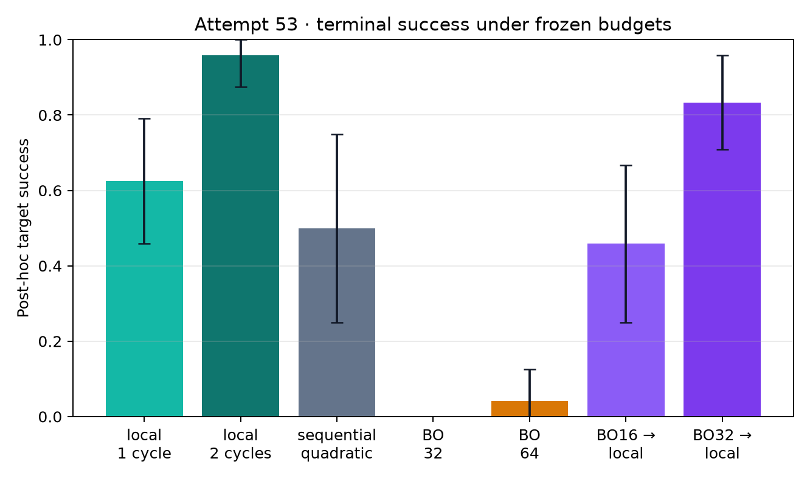

# Attempt 53 report — Bayesian and hybrid rank-15 calibration

Evidence level: **exploratory development**, not holdout confirmation.

All equal-budget comparisons use identical online resources; reduced variants
test whether success can be retained with fewer queries and shots. The
optimizer never received exact truth fidelity, and the primary score uses only
the online-selected terminal output.

## Results

| Method | Terminal target success (95% truth-cell bootstrap) | Mean log10 terminal infidelity | Queries | Shots |
|---|---:|---:|---:|---:|
| `principal-global-1cycle-k15` | 62.50% [45.83%, 79.17%] | -3.066 [-3.174, -2.959] | 34 | 1,050,624 |
| `principal-global-2cycle-k15` | 95.83% [87.50%, 100.00%] | -3.423 [-3.515, -3.324] | 66 | 2,099,200 |
| `sequential-quadratic-k15` | 50.00% [25.00%, 75.00%] | -3.230 [-3.463, -2.992] | 66 | 2,099,200 |
| `bayes-32-k15` | 0.00% [0.00%, 0.00%] | -2.501 [-2.559, -2.447] | 34 | 1,050,624 |
| `bayes-64-k15` | 4.17% [0.00%, 12.50%] | -2.597 [-2.656, -2.540] | 66 | 2,099,200 |
| `bayes16-then-global-k15` | 45.83% [25.00%, 66.67%] | -3.077 [-3.240, -2.916] | 50 | 1,574,912 |
| `bayes32-then-global-k15` | 83.33% [70.83%, 95.83%] | -3.284 [-3.344, -3.224] | 66 | 2,099,200 |

## Paired success difference versus full two-cycle principal-global method

| Method | Difference (percentage points, 95% interval) |
|---|---:|
| `principal-global-1cycle-k15` | -33.33 pp [-50.00, -16.67] |
| `sequential-quadratic-k15` | -45.83 pp [-70.94, -20.83] |
| `bayes-32-k15` | -95.83 pp [-100.00, -87.50] |
| `bayes-64-k15` | -91.67 pp [-100.00, -79.17] |
| `bayes16-then-global-k15` | -50.00 pp [-70.83, -29.17] |
| `bayes32-then-global-k15` | -12.50 pp [-25.00, +0.00] |

## Interpretation rule

An equal-budget Bayesian method is a candidate for follow-up when it improves
paired success. A reduced-budget method is useful only if it remains
non-inferior to the full two-cycle local baseline. This experiment is not
sufficient for a new submission claim: any selected method must be frozen and
rerun on disjoint truth seeds.

The sequential method is a budget-matched four-point line-scan proxy, not a
literal reproduction of the paper's experimental scan allocation.

## Result

This experiment does **not** support replacing the current local method with
pure Bayesian optimization:

- pure BO reached 0.00% success at 34 queries and 4.17% at 66 queries;
- the full BO32-to-local hybrid reached 83.33%, below the existing two-cycle
  local method's 95.83%;
- the reduced BO16-to-local hybrid reached only 45.83%, so its 24.2% query
  reduction and 25.0% shot reduction did not retain performance; and
- one ordinary local cycle was already stronger than the reduced hybrid while
  using only 34 rather than 50 total queries.

The useful mechanism is the local Hessian-preconditioned refinement, not the
current GP search by itself. At this 15-dimensionality and budget, 30–62 noisy
observations are insufficient for the fixed Matérn surrogate to identify a
terminal target pulse reliably.

## Family diagnosis

| Method | control-map | drift | combined |
|---|---:|---:|---:|
| one-cycle local | 87.5% | 25.0% | 75.0% |
| two-cycle local | 100.0% | 87.5% | 100.0% |
| sequential proxy | 62.5% | 37.5% | 50.0% |
| BO-32 | 0.0% | 0.0% | 0.0% |
| BO-64 | 12.5% | 0.0% | 0.0% |
| BO16 → local | 62.5% | 12.5% | 62.5% |
| BO32 → local | 100.0% | 50.0% | 100.0% |

Drift mismatch is the decisive failure family. The full hybrid matches the
baseline on control-map and combined cells but loses substantial reliability
on drift cells.

## Audit and claim boundary

- 168/168 runs completed with no exception or replacement.
- Every successful run closed against its method-specific 34-, 50-, or
  66-query budget and exact shot total.
- BO-32 and BO32-to-local shared identical 30-observation coordinate hashes in
  all 24 truth-cell/replicate units.
- The largest BO recommendation norm was 0.23383. The largest conservative
  hybrid recommendation-plus-local-step bound was 0.41424, below the declared
  radius 0.5; therefore a potential missing projection in the generic runner
  did not produce an out-of-domain terminal pulse in this dataset.
- The GP uses a Gaussian plug-in approximation with measured binomial
  variance, not an exact binomial likelihood.
- Exact-oracle separation is enforced by code order, not by a separate
  optimizer process. This is adequate for an exploratory run but not the
  stronger isolation required for confirmation.
- The raw JSON field `same_budget_all_methods: true` is a metadata wording
  error: budgets differ by design. The verified statement is that every method
  matches its preregistered budget and equal-budget comparison pairs match.
- Secondary best-accepted values are internal diagnostics only because methods
  expose different numbers of accepted incumbents. All headline values score
  the unique terminal output.

There are only 12 independent truth cells with two nested noise replicates.
The negative result is useful for method screening, but it is not a universal
claim against Bayesian optimization and is not direct evidence for the
paper's ten-dimensional ytterbium experiment.

## Recommendation

Do not alter the current Challenge 113 headline method. If the team later
tests Bayesian optimization on the neutral-atom simulator, the most defensible
next experiment is a lower-dimensional rank-5 or rank-10, binomial-likelihood,
trust-region BO followed by the existing local scan. It should use a new
holdout and a hard terminal-output endpoint. This is lower priority than
finishing and reviewing the current submission.

